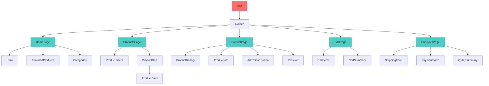
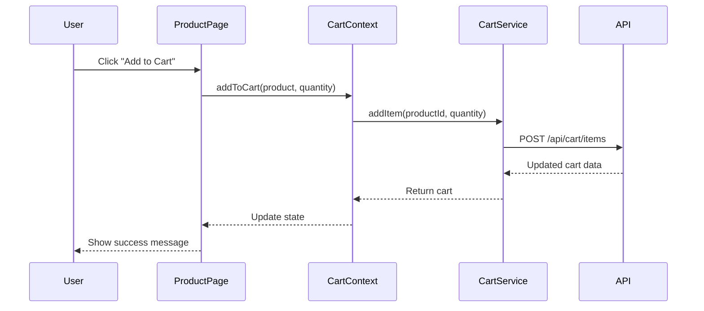
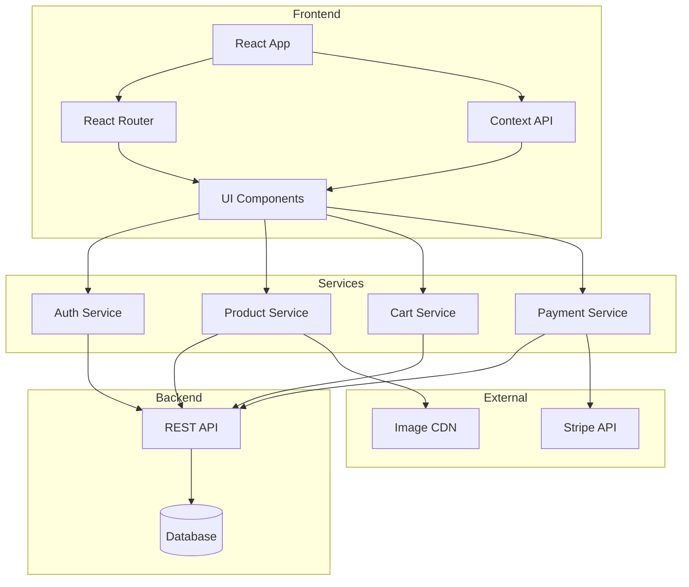
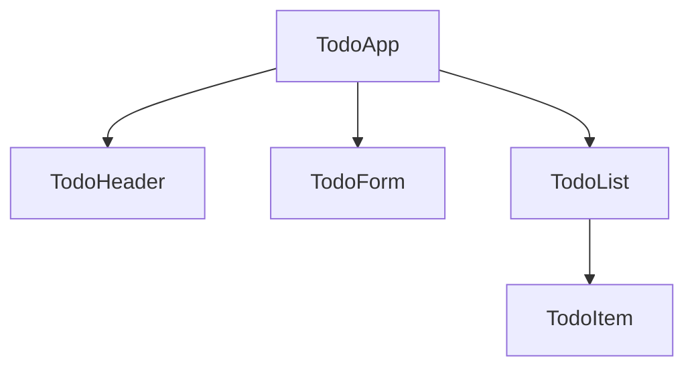

# Customization Guide

This guide shows you how to adapt the JSON models, schemas, and diagrams for your specific project.

## Quick Start Customization

### Step 1: Clear the Examples

Before adding your own project structure, you may want to remove the example components and start fresh, or keep them as reference.

**Option A: Keep Examples as Reference**
- Leave files as-is
- Add your components alongside examples
- Delete examples later as you get comfortable

**Option B: Start Fresh**
- Clear out example components from JSON files
- Keep the structure but replace with your components

---

## Customizing Component Models

### File: `models/component-structure.json`

This file defines your entire component tree and services.

### Component Definition Structure

```json
"ComponentName": {
  "type": "root | page | layout | feature | ui",
  "description": "Brief description of purpose",
  "children": ["ChildComponent1", "ChildComponent2"],
  "props": ["prop1", "prop2"],
  "state": ["stateVar1", "stateVar2"],
  "hooks": ["useEffect", "useState", "useCustomHook"],
  "responsibilities": [
    "What this component does",
    "Its primary purpose"
  ]
}
```

### Field Explanations

- **type**: Component category
  - `root` - App-level containers (App, Router)
  - `page` - Route-level components (HomePage, Dashboard)
  - `layout` - Structural components (Header, Footer, Sidebar)
  - `feature` - Feature-specific components (LoginForm, TodoList)
  - `ui` - Reusable UI components (Button, Card, Modal)

- **description**: One-line summary

- **children**: Array of child component names

- **props**: Expected props (for planning, not validation)

- **state**: Local state variables

- **hooks**: React hooks used

- **responsibilities**: What this component does (keeps scope clear)

### Example: E-commerce Product Page

```json
{
  "components": {
    "ProductPage": {
      "type": "page",
      "description": "Individual product detail page",
      "children": ["ProductGallery", "ProductInfo", "AddToCartButton", "Reviews"],
      "props": ["productId"],
      "state": ["selectedImage", "quantity"],
      "hooks": ["useEffect", "useProduct", "useState"],
      "responsibilities": [
        "Display product details",
        "Allow user to add to cart",
        "Show product reviews"
      ]
    },
    "ProductGallery": {
      "type": "feature",
      "description": "Image gallery with thumbnails",
      "children": ["ImageThumbnail"],
      "props": ["images", "selectedIndex", "onSelect"],
      "state": [],
      "hooks": [],
      "responsibilities": [
        "Display main product image",
        "Show clickable thumbnails"
      ]
    },
    "AddToCartButton": {
      "type": "ui",
      "description": "Button to add item to shopping cart",
      "children": [],
      "props": ["productId", "quantity", "disabled"],
      "state": ["isAdding"],
      "hooks": ["useCart"],
      "responsibilities": [
        "Add product to cart",
        "Show loading state",
        "Handle cart errors"
      ]
    }
  },
  "services": {
    "ProductService": {
      "description": "Handles product data operations",
      "methods": [
        "getProduct(id)",
        "searchProducts(query)",
        "getRelatedProducts(id)"
      ],
      "dependencies": ["APIService"]
    },
    "CartService": {
      "description": "Manages shopping cart operations",
      "methods": [
        "addItem(productId, quantity)",
        "removeItem(itemId)",
        "updateQuantity(itemId, quantity)",
        "getCart()"
      ],
      "dependencies": ["APIService", "AuthService"]
    }
  }
}
```

### Tips for Component Models

1. **Start with pages**: List your routes/pages first
2. **Break down each page**: Identify major sections
3. **Identify reusable UI**: Components used across pages
4. **Document services**: Backend interaction logic
5. **Keep it high-level**: Don't over-detail, just structure

---

## Customizing State Management

### File: `models/state-management.json`

Define your global state, contexts, and custom hooks.

### Context Structure

```json
"ContextName": {
  "state": {
    "variable1": "type",
    "variable2": "type"
  },
  "actions": {
    "actionName": "(params) => returnType"
  }
}
```

### Custom Hook Structure

```json
"useHookName": {
  "params": ["param1", "param2"],
  "returns": "{ data, loading, error }",
  "usage": "Description of when to use this hook"
}
```

### Example: E-commerce State

```json
{
  "stateArchitecture": {
    "approach": "Context API for global state, React Query for server state",
    "alternative": "Zustand for simpler global state management"
  },
  "contexts": {
    "CartContext": {
      "state": {
        "items": "CartItem[]",
        "total": "number",
        "itemCount": "number"
      },
      "actions": {
        "addToCart": "(product, quantity) => void",
        "removeFromCart": "(itemId) => void",
        "updateQuantity": "(itemId, quantity) => void",
        "clearCart": "() => void"
      }
    },
    "AuthContext": {
      "state": {
        "user": "User | null",
        "isAuthenticated": "boolean",
        "token": "string | null"
      },
      "actions": {
        "login": "(credentials) => Promise<void>",
        "logout": "() => void",
        "register": "(userData) => Promise<void>"
      }
    },
    "WishlistContext": {
      "state": {
        "items": "Product[]"
      },
      "actions": {
        "addToWishlist": "(product) => void",
        "removeFromWishlist": "(productId) => void",
        "isInWishlist": "(productId) => boolean"
      }
    }
  },
  "customHooks": {
    "useCart": {
      "returns": "CartContext values",
      "usage": "Access shopping cart state and actions"
    },
    "useProduct": {
      "params": ["productId"],
      "returns": "{ product, loading, error, refetch }",
      "usage": "Fetch single product data"
    },
    "useProducts": {
      "params": ["filters", "pagination"],
      "returns": "{ products, loading, error, hasMore, loadMore }",
      "usage": "Fetch and paginate product list"
    },
    "useCheckout": {
      "params": [],
      "returns": "{ processPayment, isProcessing, error }",
      "usage": "Handle checkout flow"
    }
  }
}
```

### Tips for State Management

1. **Global vs Local**: Only put truly global state in contexts
2. **Server state**: Use custom hooks for API data (consider React Query)
3. **Keep contexts focused**: Separate concerns (auth, cart, theme)
4. **Document hook contracts**: Be clear about params and returns

---

## Customizing Component Props Schema

### File: `schemas/component-props.json`

Define prop shapes for components. Useful for generating TypeScript interfaces or PropTypes.

### Schema Structure

```json
"ComponentNameProps": {
  "type": "object",
  "properties": {
    "propName": {
      "type": "string | number | boolean | object | array | function",
      "enum": ["option1", "option2"],  // For restricted values
      "format": "uri | email",          // For validation
      "description": "What this prop does"
    }
  },
  "required": ["requiredProp1", "requiredProp2"]
}
```

### Example: E-commerce Props

```json
{
  "$schema": "http://json-schema.org/draft-07/schema#",
  "definitions": {
    "ProductCardProps": {
      "type": "object",
      "properties": {
        "product": {
          "type": "object",
          "description": "Product object with id, name, price, image"
        },
        "onAddToCart": {
          "type": "function",
          "description": "Callback when add to cart is clicked"
        },
        "showQuickView": {
          "type": "boolean",
          "description": "Whether to show quick view button"
        },
        "variant": {
          "type": "string",
          "enum": ["grid", "list"],
          "description": "Display style"
        }
      },
      "required": ["product", "onAddToCart"]
    },
    "AddToCartButtonProps": {
      "type": "object",
      "properties": {
        "productId": {
          "type": "string",
          "description": "ID of product to add"
        },
        "quantity": {
          "type": "number",
          "description": "Quantity to add"
        },
        "disabled": {
          "type": "boolean"
        },
        "size": {
          "type": "string",
          "enum": ["sm", "md", "lg"]
        },
        "onSuccess": {
          "type": "function",
          "description": "Callback on successful add"
        },
        "onError": {
          "type": "function",
          "description": "Callback on error"
        }
      },
      "required": ["productId"]
    },
    "PriceDisplayProps": {
      "type": "object",
      "properties": {
        "amount": {
          "type": "number",
          "description": "Price amount"
        },
        "currency": {
          "type": "string",
          "description": "Currency code (USD, EUR, etc.)"
        },
        "showDiscount": {
          "type": "boolean"
        },
        "originalPrice": {
          "type": "number",
          "description": "Original price if on sale"
        }
      },
      "required": ["amount"]
    }
  }
}
```

### Converting to TypeScript Interfaces

```typescript
// Generated from ProductCardProps
interface ProductCardProps {
  product: Product;
  onAddToCart: (product: Product) => void;
  showQuickView?: boolean;
  variant: 'grid' | 'list';
}
```

### Converting to PropTypes

```javascript
ProductCard.propTypes = {
  product: PropTypes.object.isRequired,
  onAddToCart: PropTypes.func.isRequired,
  showQuickView: PropTypes.bool,
  variant: PropTypes.oneOf(['grid', 'list']),
};
```

---

## Customizing API Contracts

### File: `schemas/api-contracts.json`

Document your API endpoints and their request/response shapes.

### Example: E-commerce API

```json
{
  "$schema": "http://json-schema.org/draft-07/schema#",
  "endpoints": {
    "GET /api/products": {
      "description": "Get paginated product list",
      "queryParams": {
        "page": "number",
        "limit": "number",
        "category": "string",
        "sort": "'price-asc' | 'price-desc' | 'newest'",
        "search": "string"
      },
      "response": {
        "products": "Product[]",
        "total": "number",
        "page": "number",
        "hasMore": "boolean"
      }
    },
    "GET /api/products/:id": {
      "description": "Get single product details",
      "params": {
        "id": "string"
      },
      "response": {
        "product": "Product"
      }
    },
    "POST /api/cart/items": {
      "description": "Add item to cart",
      "body": {
        "productId": "string",
        "quantity": "number"
      },
      "response": {
        "cart": "Cart",
        "message": "string"
      }
    },
    "POST /api/checkout": {
      "description": "Process checkout",
      "body": {
        "cartId": "string",
        "shippingAddress": "Address",
        "billingAddress": "Address",
        "paymentMethod": "PaymentMethod"
      },
      "response": {
        "orderId": "string",
        "status": "'success' | 'failed'",
        "message": "string"
      }
    }
  },
  "types": {
    "Product": {
      "id": "string",
      "name": "string",
      "description": "string",
      "price": "number",
      "images": "string[]",
      "category": "string",
      "inStock": "boolean",
      "rating": "number"
    },
    "CartItem": {
      "id": "string",
      "product": "Product",
      "quantity": "number",
      "subtotal": "number"
    },
    "Cart": {
      "id": "string",
      "items": "CartItem[]",
      "total": "number",
      "itemCount": "number"
    }
  }
}
```

---

## Customizing Diagrams

### Component Hierarchy (`diagrams/component-hierarchy.md`)

Update the Mermaid diagram to match your component tree:



### Data Flow (`diagrams/data-flow.md`)

Show how data moves through your application:



### App Architecture (`diagrams/app-architecture.md`)

High-level system architecture:



---

## Customization Workflow

### 1. Identify Your Core Features

List the main features of your app:
- [ ] User authentication
- [ ] Product catalog
- [ ] Shopping cart
- [ ] Checkout
- [ ] User profile
- [ ] Order history
- [ ] (Add your features...)

### 2. Map to Components

For each feature, identify:
- Main page component
- Feature components
- Reusable UI components

### 3. Define State Requirements

Decide what goes where:
- **Local state**: Component-specific UI
- **Context**: Shared across app
- **Server state**: From API

### 4. Update JSON Files

1. Edit `component-structure.json`
2. Edit `state-management.json`
3. Edit `component-props.json`
4. Edit `api-contracts.json`

### 5. Update Diagrams

1. Component hierarchy
2. Data flow
3. App architecture

### 6. Document Decisions

Update `docs/design-decisions.md` with:
- Tech choices (state management library, UI framework)
- Architecture patterns
- Deployment strategy

### 7. Commit Changes

```bash
git add .
git commit -m "Customized for [your project name]"
git push
```

---

## Template Customization

### Before Copying Templates

1. **Review the component model** for what you're building
2. **Check prop schema** for the component
3. **Identify state and hooks** needed

### After Copying to Main Project

1. **Rename component**
2. **Add props** from schema
3. **Add state** from model
4. **Import hooks** defined in state-management
5. **Implement responsibilities** listed in model
6. **Style** according to your design system

---

## Example: Full Customization for Todo App

See how to customize everything for a simple Todo app:

### 1. Component Structure

```json
{
  "components": {
    "TodoApp": {
      "type": "root",
      "children": ["TodoHeader", "TodoForm", "TodoList"],
      "state": [],
      "responsibilities": ["Main app container"]
    },
    "TodoForm": {
      "type": "feature",
      "props": [],
      "state": ["inputValue"],
      "hooks": ["useState", "useTodos"],
      "responsibilities": ["Add new todos"]
    },
    "TodoList": {
      "type": "feature",
      "props": [],
      "state": ["filter"],
      "hooks": ["useTodos"],
      "responsibilities": ["Display and filter todos"]
    },
    "TodoItem": {
      "type": "ui",
      "props": ["todo", "onToggle", "onDelete"],
      "state": [],
      "responsibilities": ["Display single todo"]
    }
  }
}
```

### 2. State Management

```json
{
  "contexts": {
    "TodoContext": {
      "state": {
        "todos": "Todo[]"
      },
      "actions": {
        "addTodo": "(text) => void",
        "toggleTodo": "(id) => void",
        "deleteTodo": "(id) => void"
      }
    }
  },
  "customHooks": {
    "useTodos": {
      "returns": "TodoContext values",
      "usage": "Access todo list and actions"
    }
  }
}
```

### 3. Props Schema

```json
{
  "TodoItemProps": {
    "properties": {
      "todo": {
        "type": "object",
        "properties": {
          "id": "string",
          "text": "string",
          "completed": "boolean"
        }
      },
      "onToggle": "function",
      "onDelete": "function"
    },
    "required": ["todo", "onToggle", "onDelete"]
  }
}
```

### 4. Component Hierarchy Diagram



Now you have a complete plan ready to implement!

---

## Next Steps

1. Choose a feature to build
2. Customize the JSON models for it
3. Update diagrams
4. Commit changes
5. Copy templates and start coding!

Happy customizing! 🎨
