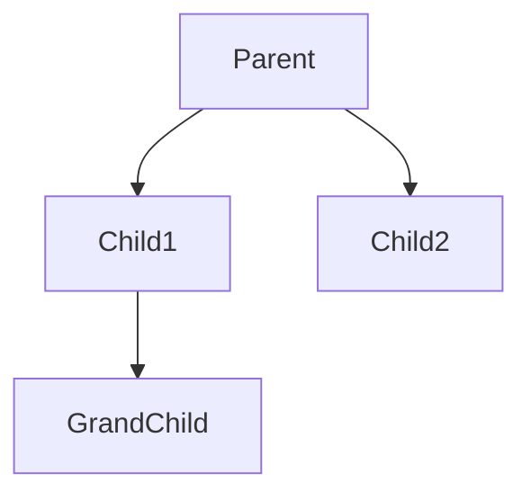
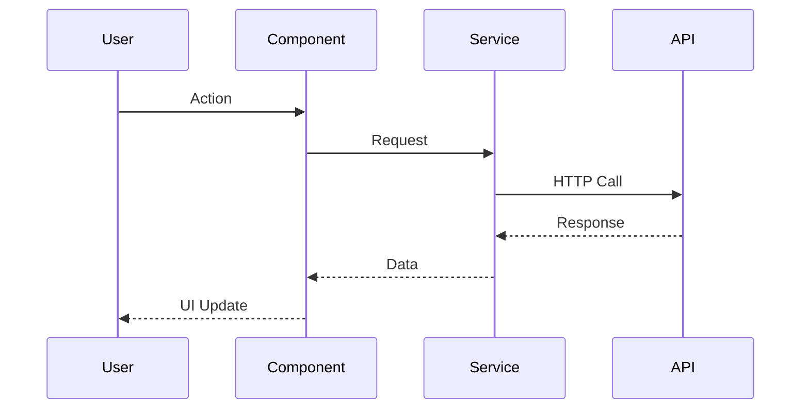
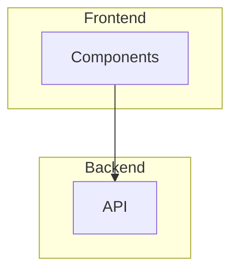

# Quick Reference Guide

Essential commands and patterns for using this OOD templates repository.

## 🔄 Git Commands (Daily Use)

```powershell
# Start of day workflow
git pull                                    # Get latest changes

# End of day workflow
git status                                  # See what changed
git add .                                   # Stage all changes
git commit -m "Your descriptive message"    # Save changes
git push                                    # Upload to GitHub
```

## 📝 Common Tasks

### 1. Plan a New Component

1. Add to [`models/component-structure.json`](models/component-structure.json)
   ```json
   "MyComponent": {
     "type": "feature",
     "children": ["SubComponent"],
     "props": ["propName"],
     "state": ["stateName"],
     "responsibilities": ["What it does"]
   }
   ```

2. Update diagram in [`diagrams/component-hierarchy.md`](diagrams/component-hierarchy.md)
   ```mermaid
   ParentComponent --> MyComponent
   MyComponent --> SubComponent
   ```

3. Commit
   ```powershell
   git add .
   git commit -m "Planned MyComponent architecture"
   git push
   ```

### 2. Copy Template to Main Project

```powershell
# Interactive mode
.\scripts\copy-template-interactive.ps1

# Or direct command
.\scripts\copy-template.ps1 -template "Component.jsx" -destination "src\components\MyComponent.jsx"
```

### 3. Add New Context

1. Edit [`models/state-management.json`](models/state-management.json)
   ```json
   "MyContext": {
     "state": {
       "value": "type"
     },
     "actions": {
       "action": "() => void"
     }
   }
   ```

2. Copy template
   ```powershell
   .\scripts\copy-template.ps1 -template "Context.jsx" -destination "src\contexts\MyContext.jsx"
   ```

### 4. Define Component Props

1. Edit [`schemas/component-props.json`](schemas/component-props.json)
   ```json
   "MyComponentProps": {
     "properties": {
       "title": { "type": "string" },
       "onClick": { "type": "function" }
     },
     "required": ["title"]
   }
   ```

2. Convert to TypeScript (in your main project)
   ```typescript
   interface MyComponentProps {
     title: string;
     onClick?: () => void;
   }
   ```

---

## 📊 File Structure Quick Reference

```
working_code/
├── README.md                    # Overview
├── GITHUB_SETUP.md             # GitHub setup guide
├── USAGE_GUIDE.md              # Complete workflow guide
├── CUSTOMIZATION_GUIDE.md      # Customization examples
├── QUICK_REFERENCE.md          # This file
│
├── models/
│   ├── component-structure.json    # Component tree & responsibilities
│   └── state-management.json       # Contexts & hooks
│
├── schemas/
│   ├── component-props.json        # Props definitions
│   └── api-contracts.json          # API endpoint specs
│
├── diagrams/
│   ├── component-hierarchy.md      # Component tree visualization
│   ├── data-flow.md               # Data flow diagrams
│   └── app-architecture.md        # High-level architecture
│
├── templates/
│   ├── Component.jsx              # Basic component
│   ├── Context.jsx                # Context provider
│   ├── Service.js                 # API service
│   └── useCustomHook.js           # Custom hook
│
├── docs/
│   ├── design-decisions.md        # Tech choices & patterns
│   └── folder-structure.md        # Project organization
│
└── scripts/
    ├── copy-template.ps1          # Copy template script
    └── copy-template-interactive.ps1  # Interactive copy
```

---

## 🎯 Component Types

| Type | Purpose | Examples |
|------|---------|----------|
| `root` | App-level containers | App, Router |
| `page` | Route-level views | HomePage, Dashboard |
| `layout` | Structural elements | Header, Footer, Sidebar |
| `feature` | Feature-specific | LoginForm, TodoList |
| `ui` | Reusable components | Button, Card, Input |

---

## 📐 Mermaid Diagram Syntax

### Component Hierarchy


### Data Flow Sequence


### Architecture Layers


**View on GitHub**: Mermaid renders automatically!

---

## 🔧 Template Customization Checklist

When copying a template:

- [ ] Rename component/function
- [ ] Update imports
- [ ] Add props from your schema
- [ ] Add state from your model
- [ ] Implement responsibilities from model
- [ ] Add styling (CSS/Tailwind)
- [ ] Add error handling
- [ ] Write tests (if applicable)

---

## 💻 Main Project Integration

### Recommended Folder Setup

```
~/Projects/
├── my-vite-app/              # Your actual React app
│   ├── src/
│   │   ├── components/
│   │   ├── pages/
│   │   ├── contexts/
│   │   ├── hooks/
│   │   └── services/
│   └── package.json
│
└── react-ood-templates/      # This planning repo
    ├── models/
    ├── schemas/
    └── templates/
```

### Workflow

1. Plan in `react-ood-templates/`
2. Copy to `my-vite-app/src/`
3. Implement in `my-vite-app/`
4. Document learnings back in `react-ood-templates/`

---

## 🐛 Common Issues

### Issue: "remote origin already exists"
```powershell
git remote remove origin
git remote add origin YOUR_URL
```

### Issue: Can't push to GitHub
- Use Personal Access Token, not password
- Generate at: https://github.com/settings/tokens

### Issue: Merge conflict after pull
```powershell
git pull
# Open conflicted files, resolve manually
git add .
git commit -m "Resolved merge conflict"
git push
```

### Issue: Template script not found
```powershell
# Make sure you're in the repo root
cd C:\Users\alexf\Desktop\working_code
# Then run
.\scripts\copy-template.ps1 -template "Component.jsx" -destination "path"
```

---

## 📖 JSON Model Examples

### Component Definition
```json
{
  "ComponentName": {
    "type": "page | layout | feature | ui",
    "description": "What it does",
    "children": ["Child1", "Child2"],
    "props": ["prop1", "prop2"],
    "state": ["state1"],
    "hooks": ["useState", "useCustomHook"],
    "responsibilities": [
      "First responsibility",
      "Second responsibility"
    ]
  }
}
```

### Context Definition
```json
{
  "ContextName": {
    "state": {
      "variable": "type"
    },
    "actions": {
      "actionName": "(params) => returnType"
    }
  }
}
```

### Custom Hook Definition
```json
{
  "useHookName": {
    "params": ["param1", "param2"],
    "returns": "{ data, loading, error }",
    "usage": "When to use this hook"
  }
}
```

### Props Schema
```json
{
  "ComponentProps": {
    "type": "object",
    "properties": {
      "propName": {
        "type": "string | number | boolean | object | array",
        "description": "What this prop does"
      }
    },
    "required": ["requiredProp"]
  }
}
```

---

## 🎨 Styling Integration

### CSS Modules (Template default)
```jsx
import styles from './Component.module.css';

<div className={styles.container}>
```

### Tailwind CSS
```jsx
<div className="flex items-center p-4 bg-blue-500">
```

### Styled Components
```jsx
import styled from 'styled-components';

const Container = styled.div`
  padding: 1rem;
`;
```

Update templates to match your chosen approach!

---

## 🔐 Authentication Example

### 1. Plan (state-management.json)
```json
"AuthContext": {
  "state": {
    "user": "User | null",
    "isAuthenticated": "boolean"
  },
  "actions": {
    "login": "(credentials) => Promise<void>",
    "logout": "() => void"
  }
}
```

### 2. Copy Template
```powershell
.\scripts\copy-template.ps1 -template "Context.jsx" -destination "src\contexts\AuthContext.jsx"
```

### 3. Implement
Edit `AuthContext.jsx` following your plan.

---

## 📱 Multi-Computer Sync

### Computer 1 (Morning)
```powershell
cd C:\Users\alexf\Desktop\working_code
git pull
# Make changes
git add .
git commit -m "Planned new features"
git push
```

### Computer 2 (Afternoon)
```powershell
cd ~/Documents/working_code
git pull  # Gets changes from Computer 1
# Make more changes
git add .
git commit -m "Updated diagrams"
git push
```

### Computer 1 (Evening)
```powershell
git pull  # Gets changes from Computer 2
```

---

## ✅ Best Practices

### Do
- ✅ Plan before coding
- ✅ Commit frequently with clear messages
- ✅ Pull before starting work
- ✅ Push after completing changes
- ✅ Keep diagrams updated
- ✅ Document decisions

### Don't
- ❌ Code in this repo (it's for planning!)
- ❌ Commit without pulling first
- ❌ Use vague commit messages
- ❌ Skip diagram updates
- ❌ Forget to push

---

## 🚀 Productivity Tips

### 1. Aliases (PowerShell Profile)
Add to `$PROFILE`:

```powershell
function gsync { git add .; git commit -m "$args"; git push }
function gpull { git pull }
```

Usage:
```powershell
gsync "Updated component models"
gpull
```

### 2. VS Code Integration
- Install "Mermaid Preview" extension
- View diagrams without GitHub
- Use Git panel for visual commits

### 3. Template Workflow
Keep a checklist in your main project:

```markdown
## New Component Checklist
- [ ] Plan in component-structure.json
- [ ] Add to component-hierarchy diagram
- [ ] Copy template
- [ ] Implement component
- [ ] Update diagram if structure changed
```

---

## 📚 Learning Resources

- **React Docs**: https://react.dev
- **Vite Docs**: https://vitejs.dev
- **Mermaid Docs**: https://mermaid.js.org
- **Git Cheatsheet**: https://education.github.com/git-cheat-sheet-education.pdf

---

## 🎓 Example Projects in This Repo

See `CUSTOMIZATION_GUIDE.md` for complete examples:
- Todo App
- E-commerce Site
- Dashboard Application

---

## 📞 Quick Help

| Need to... | Do this... |
|------------|------------|
| Get latest changes | `git pull` |
| Save your changes | `git add . && git commit -m "msg" && git push` |
| Copy a template | `.\scripts\copy-template-interactive.ps1` |
| View diagrams | Open .md files in diagrams/ on GitHub |
| Plan a component | Edit `models/component-structure.json` |
| Define props | Edit `schemas/component-props.json` |
| Add context | Edit `models/state-management.json` |

---

## 🎯 Your Next Action

Choose one:

1. **First time setup**: Follow [GITHUB_SETUP.md](GITHUB_SETUP.md)
2. **Learn the workflow**: Read [USAGE_GUIDE.md](USAGE_GUIDE.md)
3. **Customize for your project**: Follow [CUSTOMIZATION_GUIDE.md](CUSTOMIZATION_GUIDE.md)
4. **Start planning**: Edit `models/component-structure.json`

---

Need more detail? Check the full guides! 📖
