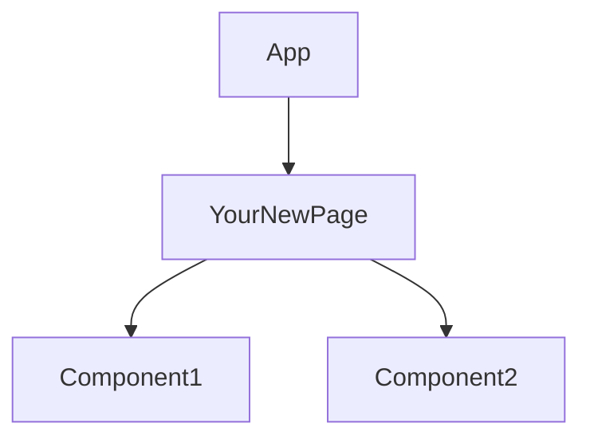
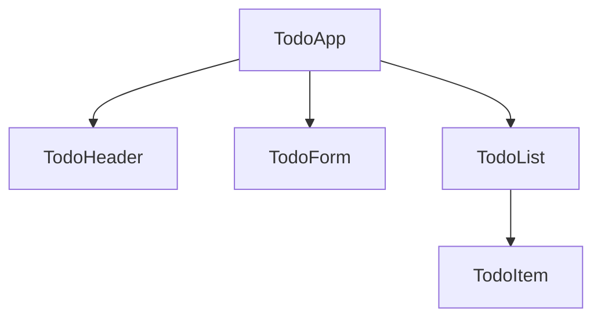

# How to Use This OOD Templates Repository

This guide walks you through effectively using this repository for planning and building your Vite + React project.

## Workflow Overview

```
Plan (JSON/Diagrams) → Design (Models) → Implement (Templates) → Sync (Git)
```

---

## Step 1: Planning Your Application

### 1.1 Define Components in JSON Models

Start by editing [`models/component-structure.json`](models/component-structure.json):

**Example: Adding a new page**
```json
"DashboardPage": {
  "type": "page",
  "description": "User dashboard with analytics",
  "children": ["DashboardHeader", "StatsGrid", "ActivityFeed"],
  "props": ["userId"],
  "state": ["selectedPeriod"],
  "hooks": ["useEffect", "useAPI"],
  "responsibilities": [
    "Display user statistics",
    "Show recent activity"
  ]
}
```

**Why this helps:**
- Forces you to think about component responsibility BEFORE coding
- Documents props and state requirements
- Identifies child components needed
- Creates a reference for implementation

### 1.2 Plan State Management

Edit [`models/state-management.json`](models/state-management.json) to define your contexts and hooks:

**Example: Adding a new context**
```json
"NotificationContext": {
  "state": {
    "notifications": "Notification[]",
    "unreadCount": "number"
  },
  "actions": {
    "addNotification": "(notification) => void",
    "markAsRead": "(id) => void",
    "clearAll": "() => void"
  }
}
```

### 1.3 Define Component Props

Edit [`schemas/component-props.json`](schemas/component-props.json) for TypeScript interfaces or prop validation:

**How to use:**
1. Define all props for your components
2. Use this as reference when implementing
3. Convert to TypeScript interfaces or PropTypes

---

## Step 2: Visualize Architecture

### 2.1 Update Component Hierarchy

Edit [`diagrams/component-hierarchy.md`](diagrams/component-hierarchy.md):



**Tips:**
- View on GitHub for automatic Mermaid rendering
- Use colors to categorize component types
- Update as your structure evolves

### 2.2 Map Data Flow

Edit [`diagrams/data-flow.md`](diagrams/data-flow.md) to show how data moves through your app:
- User actions → State updates
- API calls → Component updates
- Context providers → Consumers

### 2.3 Visualize App Architecture

Edit [`diagrams/app-architecture.md`](diagrams/app-architecture.md) for the big picture:
- Frontend layers
- API integration
- External services

---

## Step 3: Implement from Templates

When ready to code, copy templates to your main Vite + React project:

### 3.1 Creating a New Component

1. **Check your plan** in `models/component-structure.json`
2. **Copy template**: `templates/Component.jsx` → your project
3. **Customize** based on your JSON model:
   - Rename component
   - Add props from schema
   - Add state from model
   - Implement responsibilities

**Example workflow:**
```bash
# In your main Vite project
cp ../working_code/templates/Component.jsx src/components/Dashboard.jsx
```

Then edit `Dashboard.jsx` following your plan in `component-structure.json`.

### 3.2 Creating a Custom Hook

1. Copy `templates/useCustomHook.js`
2. Implement based on `state-management.json` definitions
3. Use the hook structure for consistency

### 3.3 Creating a Context Provider

1. Copy `templates/Context.jsx`
2. Implement state and actions from `state-management.json`
3. Add to your app's provider tree

### 3.4 Creating a Service

1. Copy `templates/Service.js`
2. Implement methods defined in `component-structure.json` services
3. Use API contracts from `schemas/api-contracts.json`

---

## Step 4: Customize for Your Project

### Quick Customization Checklist

- [ ] Update component list in `models/component-structure.json`
- [ ] Define your contexts in `models/state-management.json`
- [ ] Add your component props to `schemas/component-props.json`
- [ ] Add your API endpoints to `schemas/api-contracts.json`
- [ ] Update all three diagrams to match your structure
- [ ] Document tech stack decisions in `docs/design-decisions.md`
- [ ] Document folder structure in `docs/folder-structure.md`

### Example: Planning a Todo App

**1. Edit `component-structure.json`:**
```json
{
  "components": {
    "TodoApp": {
      "type": "root",
      "children": ["TodoHeader", "TodoList", "TodoForm"],
      "state": [],
      "responsibilities": ["Manage todo application"]
    },
    "TodoList": {
      "type": "feature",
      "children": ["TodoItem"],
      "props": ["todos", "onToggle", "onDelete"],
      "state": [],
      "responsibilities": ["Display list of todos"]
    },
    "TodoItem": {
      "type": "ui",
      "children": [],
      "props": ["todo", "onToggle", "onDelete"],
      "state": [],
      "responsibilities": ["Display single todo", "Handle interactions"]
    }
  }
}
```

**2. Update `component-hierarchy.md`:**


**3. Implement from template:**
- Copy `Component.jsx` → `TodoItem.jsx`
- Add props: `todo`, `onToggle`, `onDelete`
- Implement the display and click handlers

---

## Step 5: Sync Across Computers

### First Time Setup (Current Computer)

```bash
# 1. Add all files
git add .

# 2. Commit
git commit -m "Initial OOD templates and architecture"

# 3. Create GitHub repo (do this on GitHub.com)
# Click "New Repository", name it (e.g., "react-ood-templates")
# Don't initialize with README (you already have one)

# 4. Add remote and push
git remote add origin https://github.com/YOUR_USERNAME/react-ood-templates.git
git branch -M main
git push -u origin main
```

### On Your Second Computer

```bash
# Clone the repository
git clone https://github.com/YOUR_USERNAME/react-ood-templates.git
cd react-ood-templates
```

### Daily Workflow (Any Computer)

```bash
# Before you start working
git pull

# After making changes
git add .
git commit -m "Updated Dashboard component architecture"
git push
```

---

## Best Practices

### ✅ Do

- **Plan before coding**: Update JSON models first
- **Keep diagrams current**: Update as architecture changes
- **Document decisions**: Use `docs/design-decisions.md`
- **Sync frequently**: Commit and push changes regularly
- **Reference templates**: Use them as starting points, not final code

### ❌ Don't

- **Don't code here**: This is for planning, not implementation
- **Don't skip planning**: The models help you think through design
- **Don't forget to push**: Keep both computers in sync
- **Don't treat as final**: These are templates to customize

---

## Practical Example: Building a Feature

Let's say you want to build a user profile page:

### Phase 1: Planning (In this repo)

1. **Add to `component-structure.json`:**
   ```json
   "ProfilePage": {
     "type": "page",
     "children": ["ProfileHeader", "ProfileForm", "AvatarUpload"],
     "props": ["userId"],
     "state": ["isEditing", "formData"],
     "hooks": ["useAuth", "useAPI"],
     "responsibilities": ["Display user profile", "Allow editing"]
   }
   ```

2. **Add to `state-management.json`:**
   ```json
   "useProfile": {
     "params": ["userId"],
     "returns": "{ profile, loading, error, updateProfile }",
     "usage": "Fetch and update user profile"
   }
   ```

3. **Add to `component-hierarchy.md`:**
   ```mermaid
   Router --> ProfilePage
   ProfilePage --> ProfileHeader
   ProfilePage --> ProfileForm
   ProfilePage --> AvatarUpload
   ```

4. **Commit and push:**
   ```bash
   git add .
   git commit -m "Planned ProfilePage architecture"
   git push
   ```

### Phase 2: Implementation (In your Vite project)

1. **Copy template:**
   ```bash
   cp ../working_code/templates/Component.jsx src/pages/ProfilePage.jsx
   ```

2. **Implement using your plan:**
   - Reference `component-structure.json` for props and state
   - Reference `state-management.json` for hooks to create
   - Follow the responsibilities you documented

3. **Build the feature** in your main project

### Phase 3: Update OOD Repo (Back in this repo)

1. **Document what you learned:**
   - Update `docs/design-decisions.md` with any discoveries
   - Refine models if your implementation differed from plan
   - Update diagrams if structure changed

2. **Sync changes:**
   ```bash
   git add .
   git commit -m "Updated ProfilePage docs after implementation"
   git push
   ```

---

## Integration with Main Project

### Recommended Setup

```
~/Projects/
  ├── my-vite-app/           # Your actual React application
  │   ├── src/
  │   ├── public/
  │   └── package.json
  │
  └── react-ood-templates/   # This planning repository
      ├── models/
      ├── schemas/
      ├── diagrams/
      └── templates/
```

### Copy Templates Script

Create a helper script in your main project:

**`scripts/copy-template.sh`** (Mac/Linux) or **`scripts/copy-template.ps1`** (Windows)

```powershell
# copy-template.ps1
param($templateName, $destination)
Copy-Item "../react-ood-templates/templates/$templateName" -Destination "./src/$destination"
Write-Host "Copied $templateName to $destination"
```

Usage:
```powershell
./scripts/copy-template.ps1 Component.jsx components/MyComponent.jsx
```

---

## Quick Reference Commands

### Git Commands
```bash
# Pull latest changes
git pull

# Save your changes
git add .
git commit -m "Your message"
git push

# Check status
git status

# View history
git log --oneline
```

### Workflow Summary
1. **Plan**: Edit JSON models and diagrams
2. **Visualize**: Check diagrams on GitHub
3. **Commit**: Save your planning work
4. **Implement**: Copy templates to main project
5. **Refine**: Update OOD repo with learnings
6. **Sync**: Push changes for other computers

---

## Tips for Success

1. **Start small**: Begin with a simple feature, follow the workflow
2. **Iterate**: Your first plan won't be perfect—refine as you learn
3. **Visual first**: Look at component hierarchy diagram before coding
4. **Consistent sync**: Make it a habit to pull before work, push after
5. **Documentation**: Future you will thank present you for good notes

---

## Next Steps

1. ✅ **Initialize Git** (Done if you're reading this!)
2. ⬜ **Create GitHub repo** and push
3. ⬜ **Customize models** for your first feature
4. ⬜ **Update diagrams** to match your vision
5. ⬜ **Copy first template** and build something
6. ⬜ **Sync to second computer** when ready

Happy architecting! 🚀
