# Application Architecture

```mermaid
graph TB
    subgraph "Frontend - Vite + React"
        UI[UI Layer]
        State[State Management]
        Routing[React Router]
        Hooks[Custom Hooks]
    end
    
    subgraph "Service Layer"
        Auth[Auth Service]
        API[API Service]
        Storage[Local Storage]
    end
    
    subgraph "Backend/API"
        REST[REST API]
        DB[(Database)]
    end
    
    UI --> State
    UI --> Routing
    UI --> Hooks
    Hooks --> Auth
    Hooks --> API
    Auth --> Storage
    API --> REST
    REST --> DB
    
    style UI fill:#e63946
    style State fill:#f1faee
    style Hooks fill:#a8dadc
    style Auth fill:#457b9d
    style API fill:#457b9d
    style REST fill:#1d3557
```

## Layers

### Presentation Layer
- React components
- Styled with CSS modules/Tailwind
- Responsive design for web & mobile

### State Layer
- Context API for global state
- Local state with useState
- Server state with custom hooks

### Service Layer
- Authentication logic
- API communication
- Data transformation
- Local storage management

### Backend
- REST API endpoints
- Database operations
- Business logic
