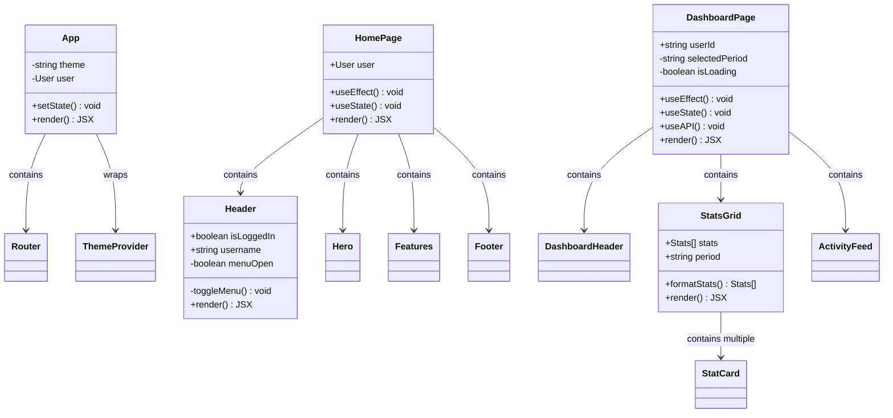
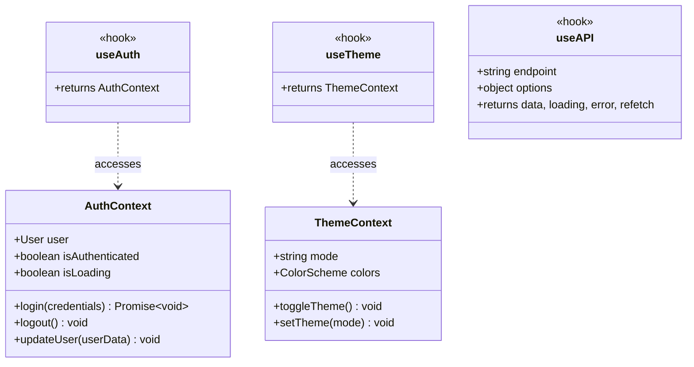
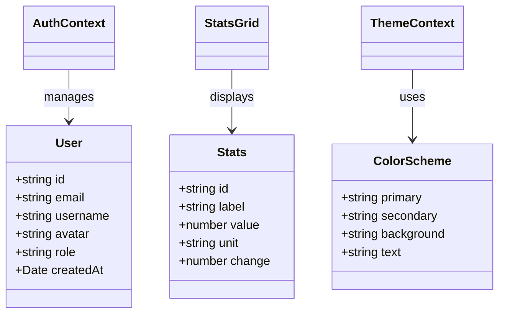

# Class Diagrams

UML-style class diagrams showing component structure with props, state, and methods.

## Component Classes



## Context Classes



## Data Models



## Legend

**Visibility:**
- `+` Public (props from parent)
- `-` Private (internal state)

**Relationships:**
- `-->` Composition (contains)
- `..>` Dependency (uses)
- `--|>` Inheritance (extends)

**Member Types:**
- Properties listed at top
- Methods listed below
- `<<stereotype>>` for special types (hooks, contexts)

## How to Update

When adding new components:

1. Add the class box:
```mermaid
class NewComponent {
    +PropType propName
    -StateType stateName
    +methodName() ReturnType
}
```

2. Add relationships:
```mermaid
ParentComponent --> NewComponent : contains
NewComponent ..> SomeContext : uses
```

3. Commit changes:
```powershell
git add diagrams/class-diagram.md
git commit -m "Added NewComponent to class diagram"
git push
```
