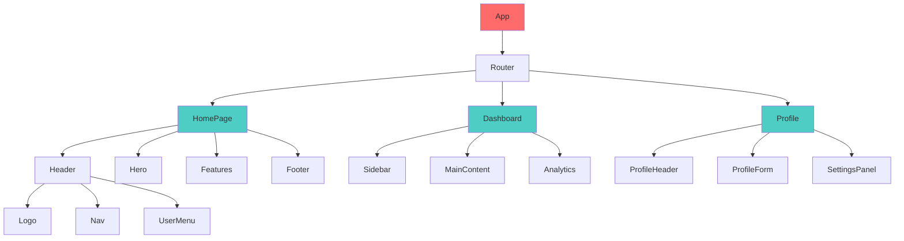

# Component Hierarchy

## Component Types

- 🔴 **Root Components** - App-level containers
- 🔵 **Page Components** - Route-level views
- 🟢 **Layout Components** - Structural elements (Header, Footer, Sidebar)
- 🟡 **UI Components** - Reusable elements (Button, Card, Input)
