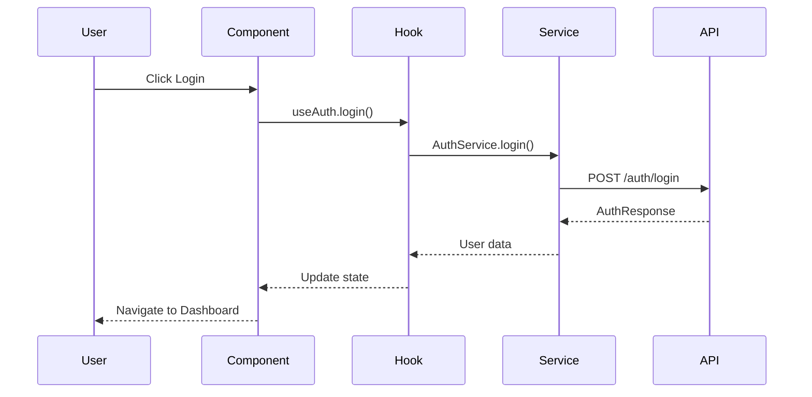
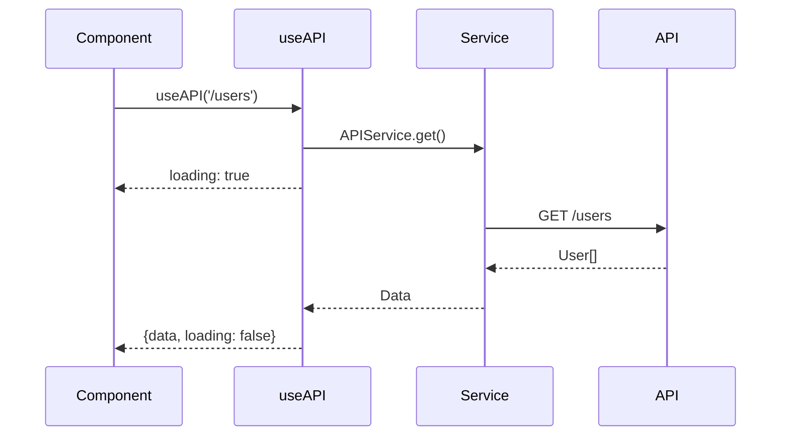

# Data Flow Architecture

```mermaid
graph LR
    UI[UI Components]
    Hooks[Custom Hooks]
    Context[Context Providers]
    Services[Services Layer]
    API[API/Backend]
    
    UI --> Hooks
    Hooks --> Context
    Hooks --> Services
    Services --> API
    Context --> UI
    API --> Services
    Services --> Hooks
    
    style UI fill:#a8dadc
    style Context fill:#457b9d
    style Services fill:#1d3557
    style API fill:#f1faee
```

## Flow Patterns

### 1. User Action → API Call

```mermaid
sequenceDiagram
    participant User
    participant Component
    participant Hook
    participant Service
    participant API
    
    User->>Component: Click Login
    Component->>Hook: useAuth.login()
    Hook->>Service: AuthService.login()
    Service->>API: POST /auth/login
    API-->>Service: AuthResponse
    Service-->>Hook: User data
    Hook-->>Component: Update state
    Component-->>User: Navigate to Dashboard
```

### 2. Data Loading Pattern

```mermaid
sequenceDiagram
    participant Component
    participant useAPI
    participant Service
    participant API
    
    Component->>useAPI: useAPI('/users')
    useAPI->>Service: APIService.get()
    useAPI-->>Component: loading: true
    Service->>API: GET /users
    API-->>Service: User[]
    Service-->>useAPI: Data
    useAPI-->>Component: {data, loading: false}
```
