# Mermaid Diagram Guide

This guide shows you how to create and customize Mermaid diagrams for your React OOD templates.

## 🎯 What is Mermaid?

Mermaid is a text-based diagramming tool that creates visual graphics from simple code. GitHub and VS Code automatically render these diagrams, so you write code and see beautiful graphics.

---

## 📊 Diagram Types You're Using

### 1. Component Hierarchy (Flowchart)

**Purpose**: Show component parent-child relationships

### 2. Class Diagrams (UML)

**Purpose**: Show component structure with props, state, and methods

**Basic Syntax**:
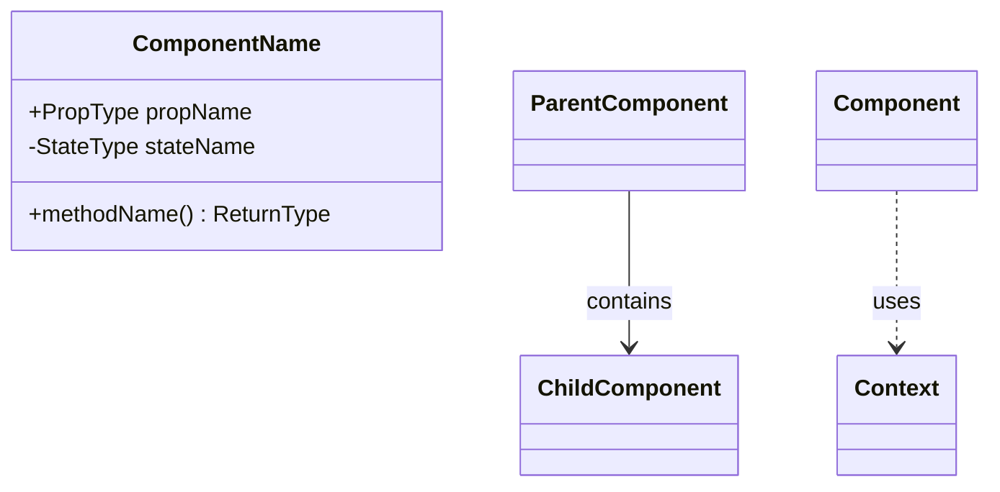

**Key Elements**:
- `+` = Public (props)
- `-` = Private (state)
- `-->` = Contains/Composition
- `..>` = Uses/Dependency
- `<<stereotype>>` = Special types (hook, context)

---

### 3. Component Hierarchy (Flowchart - Original)

**Purpose**: Show component parent-child relationships

**Basic Syntax**:
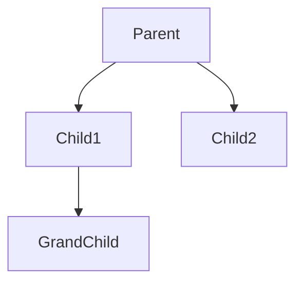

**Key Elements**:
- `graph TD` = Top-Down flowchart
- `graph LR` = Left-Right flowchart
- `-->` = Arrow pointing to child
- `Parent[Display Name]` = Custom label

**Styling**:
```mermaid
style ComponentName fill:#ff6b6b
style ComponentName fill:#4ecdc4,stroke:#333,stroke-width:2px
```

**Color Codes**:
- `#ff6b6b` - Red (for root components)
- `#4ecdc4` - Cyan (for pages)
- `#a8dadc` - Light blue (for features)
- `#457b9d` - Dark blue (for services)
- `#1d3557` - Navy (for backend)

---

### 2. Data Flow (Sequence Diagram)

**Purpose**: Show step-by-step interactions over time

**Basic Syntax**:
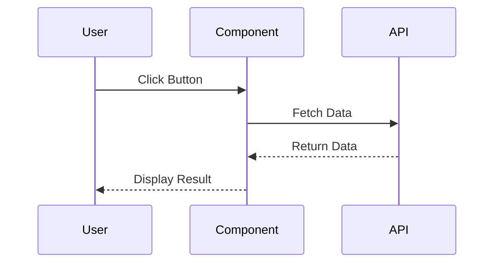

**Key Elements**:
- `participant Name` = Declare actors
- `A->>B: Message` = Solid arrow (request/action)
- `A-->>B: Message` = Dashed arrow (response/return)
- `A->>A: Message` = Self-action

**Advanced**:
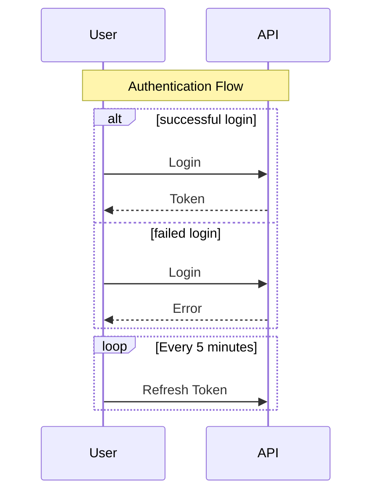

---

### 3. System Architecture (Layered Graph)

**Purpose**: Show high-level system structure with grouped components

**Basic Syntax**:
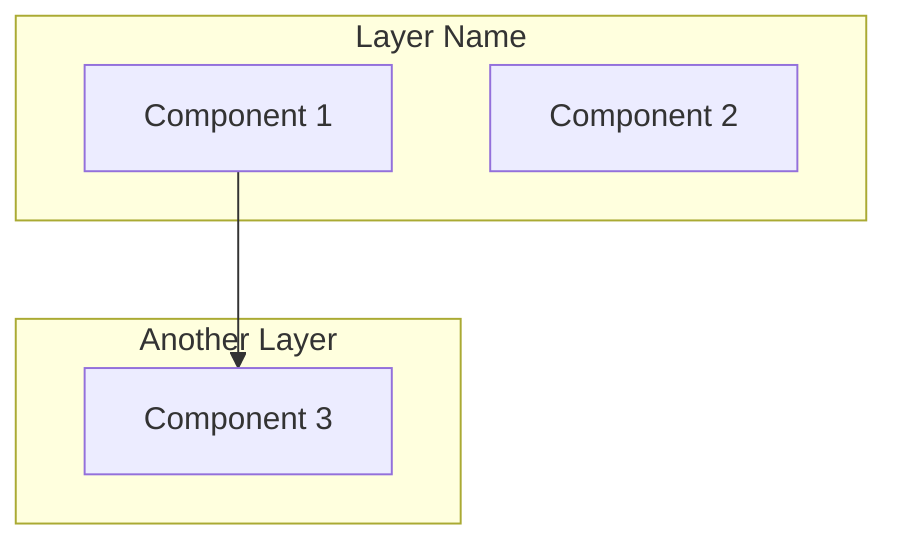

**Key Elements**:
- `subgraph "Name"` = Create a group/layer
- `TB` = Top to Bottom
- `LR` = Left to Right
- `[(Database)]` = Database cylinder shape
- `[Component]` = Rectangle shape
- `((Circle))` = Circle shape

---

## 🎨 Customization Examples

### Example 1: Class Diagram - Component Structure

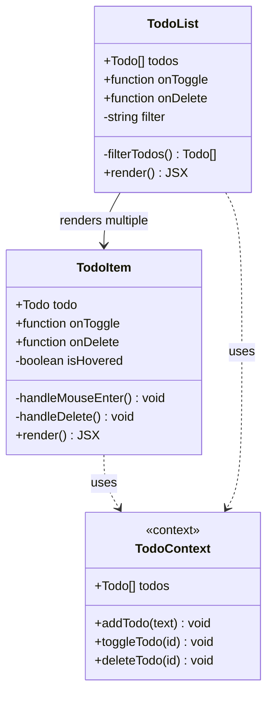

### Example 2: E-commerce Component Tree

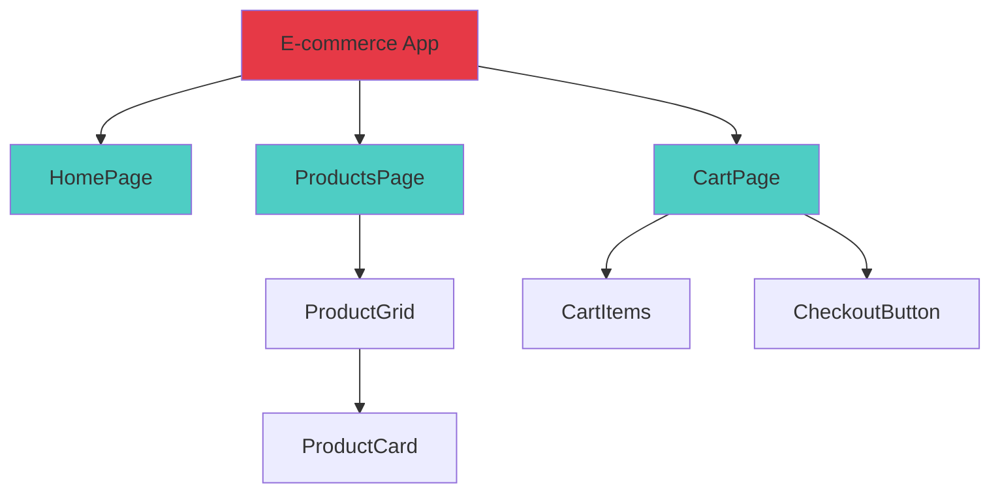

### Example 2: User Login Flow

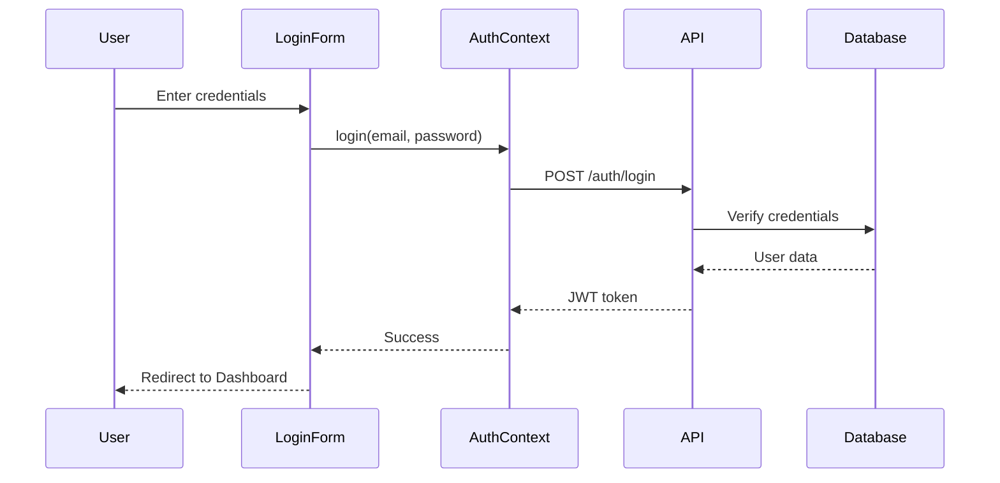

### Example 3: Todo App Architecture

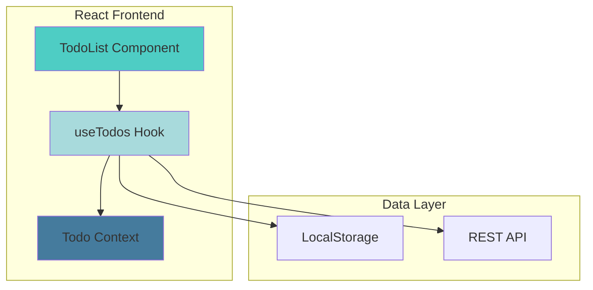

---

## ✏️ How to Edit YOUR Diagrams

### Step 1: Open a Diagram File
```powershell
code diagrams/component-hierarchy.md
```

### Step 2: Edit the Mermaid Code Block

Find this section:
````markdown
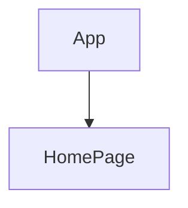
````

### Step 3: Add Your Components

````markdown
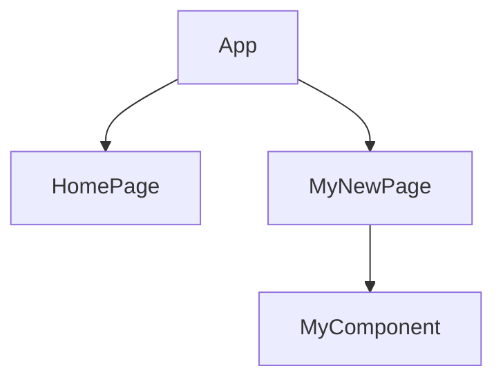
````

### Step 4: Preview (Two Options)

**Option A: GitHub**
1. Save file
2. Commit and push: `git add . && git commit -m "Updated diagram" && git push`
3. View on GitHub: https://github.com/alforeha/working_code/blob/main/diagrams/component-hierarchy.md

**Option B: VS Code**
1. Install extension: "Markdown Preview Mermaid Support"
2. Press `Ctrl+Shift+V` to preview
3. See rendered diagram instantly!

---

## 🎓 Common Patterns for React Apps

### Pattern 1: Page with Features

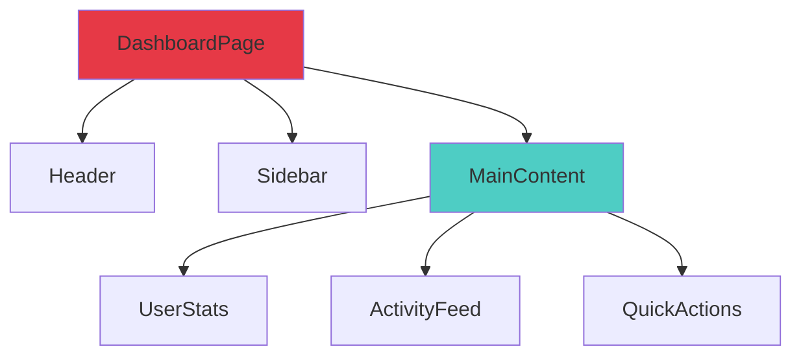

### Pattern 2: Form with Validation

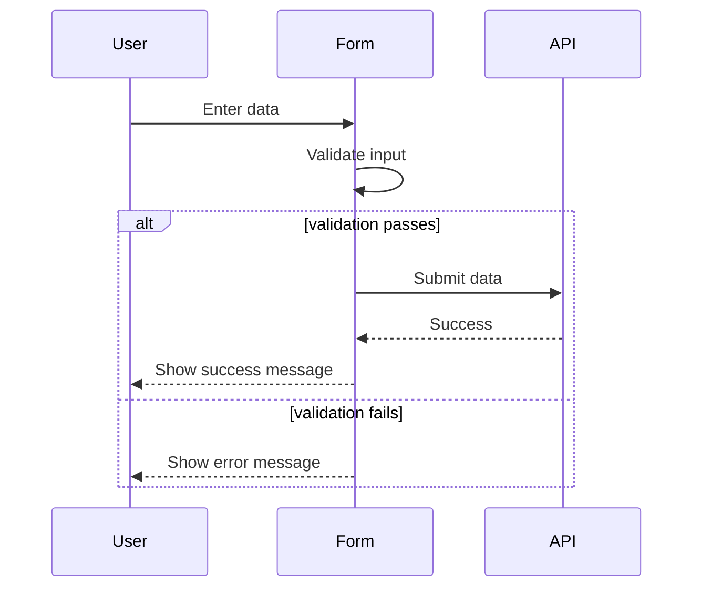

### Pattern 3: Context Provider Setup

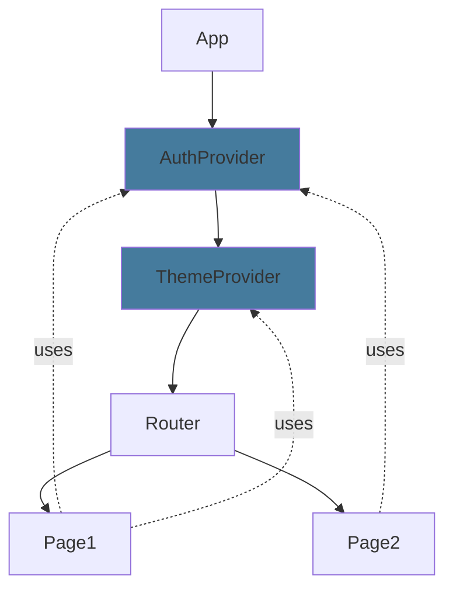

---

## 🔧 Advanced Features

### Node Shapes

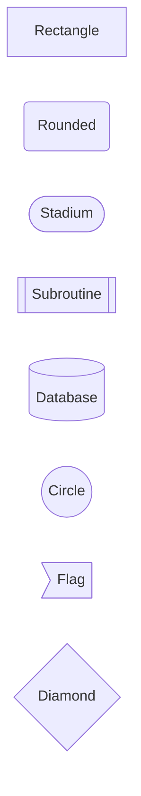

### Arrow Types

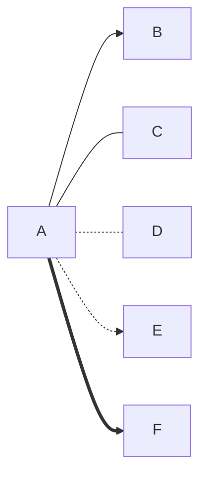

### Multiple Parents

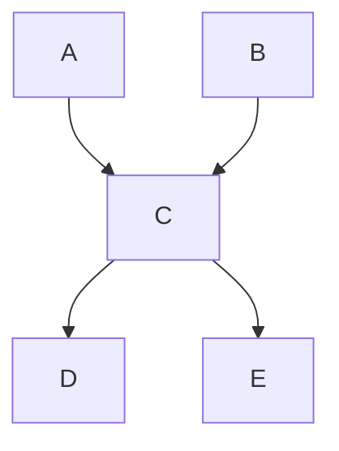

---

## 📐 Syntax Quick Reference

| Element | Syntax | Example |
|---------|--------|---------|
| Top-Down Graph | `graph TD` | Component tree |
| Left-Right Graph | `graph LR` | Process flow |
| Sequence Diagram | `sequenceDiagram` | User interactions |
| Arrow | `A --> B` | Parent to child |
| Dashed Arrow | `A -.-> B` | Optional/async |
| Thick Arrow | `A ==> B` | Primary flow |
| Label | `A[Label Text]` | Custom display name |
| Subgraph | `subgraph "Name"` | Grouped components |
| Style | `style A fill:#color` | Custom colors |
| Comment | `%% This is a comment` | Notes in code |

---

## 💡 Tips for Effective Diagrams

### 1. Keep It Simple
- Don't show EVERY component
- Focus on key relationships
- Break complex diagrams into multiple views

### 2. Use Consistent Colors
- Red (`#e63946`) = Root/App level
- Cyan (`#4ecdc4`) = Pages/Routes
- Light Blue (`#a8dadc`) = Features
- Dark Blue (`#457b9d`) = Services
- Navy (`#1d3557`) = Backend/External

### 3. Update Regularly
- Update diagrams when architecture changes
- Commit diagram updates with code changes
- Use diagrams in code reviews

### 4. Layer Your Views
- **Component Hierarchy**: What contains what
- **Data Flow**: How data moves
- **Architecture**: Big picture system design

---

## 🔄 Workflow Example

### Planning a New Feature: Shopping Cart

1. **Update Component Hierarchy**
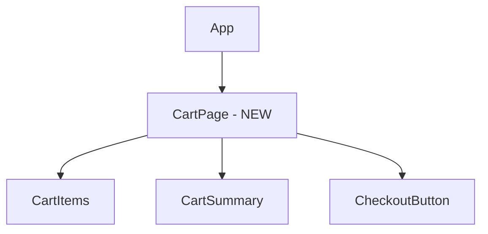

2. **Plan the Data Flow**
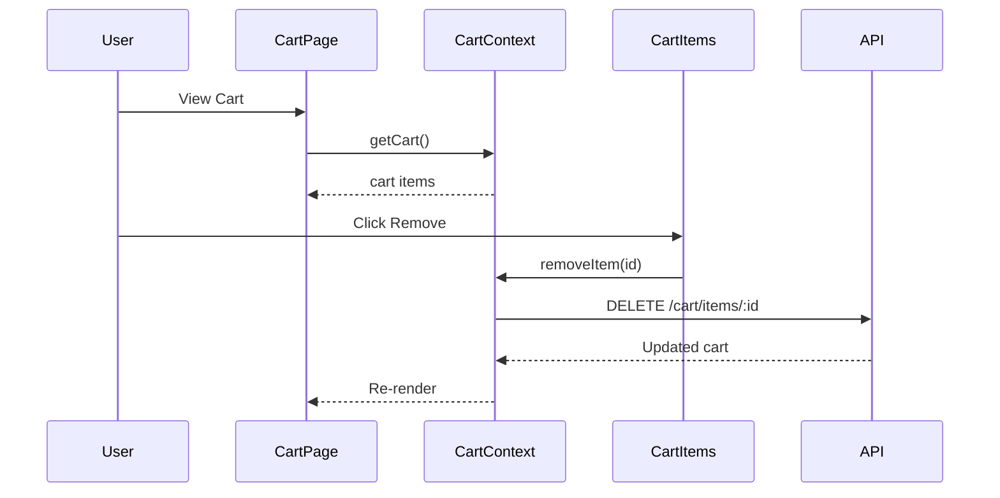

3. **Update Architecture if Needed**
```mermaid
graph TB
    subgraph Frontend
        Cart[Cart Components]
    end
    subgraph State
        CartContext[Cart Context - NEW]
    end
    Cart --> CartContext
    CartContext --> API
```

4. **Commit & Review**
```powershell
git add diagrams/
git commit -m "Planned shopping cart feature architecture"
git push
```

5. **View on GitHub**
- Review diagrams with team
- Discuss before implementation
- Reference during coding

---

## 🌐 Resources

- **Mermaid Live Editor**: https://mermaid.live (Test diagrams online)
- **Mermaid Documentation**: https://mermaid.js.org
- **Syntax Examples**: https://mermaid.js.org/syntax/examples.html
- **Your Diagrams on GitHub**: https://github.com/alforeha/working_code/tree/main/diagrams

---

## 🎯 Practice Exercise

Try updating `diagrams/component-hierarchy.md` with a simple Todo app:

```mermaid
graph TD
    TodoApp[TodoApp]
    TodoApp --> TodoHeader[TodoHeader]
    TodoApp --> TodoInput[TodoInput]
    TodoApp --> TodoList[TodoList]
    
    TodoList --> TodoItem[TodoItem]
    
    style TodoApp fill:#e63946
    style TodoList fill:#4ecdc4
```

Then:
1. Save the file
2. Commit: `git add . && git commit -m "Added Todo app diagram" && git push`
3. View on GitHub to see it rendered!

---

Happy diagramming! 📊✨
